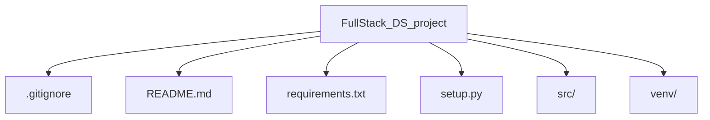

# FullStack Data Science Project

End-to-End Machine Learning project implementation with Python.

## Project Overview

This project aims to provide a comprehensive implementation of a full-stack data science project using Python. It includes data preprocessing, model training, evaluation, and deployment. The project is structured to facilitate easy navigation and understanding of each component involved in the machine learning pipeline.

## Project Structure



### File Descriptions

#### Core Files

- **.gitignore**: Specifies files and directories to exclude from version control.
- **README.md**: Provides an overview of the project, including structure, installation, usage, and contribution guidelines.
- **requirements.txt**: Lists all Python dependencies with versions.
- **setup.py**: Contains package configuration and installation instructions.

#### Source Code

- **src**: Main directory containing project source code.
- **.DS_Store**: macOS directory metadata file (auto-generated).

#### Virtual Environment

- **venv**: Python virtual environment directory (excluded via .gitignore).

## Getting Started

### Installation

To set up the project, follow these steps:

1. Clone the repository:
    ```sh
    git clone https://github.com/yourusername/FullStack_DS_project.git
    cd FullStack_DS_project
    ```

2. Create a virtual environment:
    ```sh
    python -m venv venv
    source venv/bin/activate  # On Windows use `venv\Scripts\activate`
    ```

3. Install the dependencies:
    ```sh
    pip install -r requirements.txt
    ```

4. Install the package:
    ```sh
    python setup.py install
    ```

### Usage

To use the project modules, import them as follows:
```python
from src import *
```

## Use Cases & Applications

This project can be used for various machine learning tasks, including but not limited to:

- Data preprocessing and cleaning
- Model training and evaluation
- Model deployment and monitoring

## Dataset Information

If applicable, provide details about the datasets used in the project, including sources, preprocessing steps, and any transformations applied.

## Contribution Guidelines

1. Fork the repository.
2. Create feature branches.
3. Submit pull requests for review.

## Maintenance

The project follows semantic versioning. Check `requirements.txt` for dependency updates.

## Virtual Environment

The `venv` directory contains the Python virtual environment for the project. It is excluded from version control via `.gitignore`.

## Dynamic Documentation

Ensure the documentation is updated dynamically as the project evolves. Add new sections or update existing ones as necessary to reflect changes in the project structure, dependencies, or functionality.