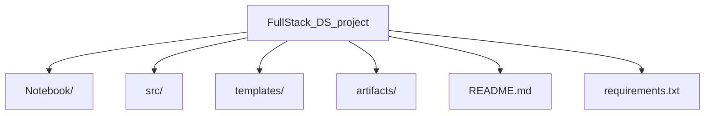

# FullStack Data Science Project

## Project Overview

This project implements an end-to-end machine learning pipeline for predicting student performance. It includes data ingestion, exploratory data analysis (EDA), data transformation, model training, and deployment. The goal is to automate the entire workflow from raw data to actionable insights and predictions.

---

## Project Structure



### Key Directories and Files

- **Notebook/**: Contains Jupyter notebooks for EDA and model experimentation.
- **src/**: Source code for the project, including pipelines and utility scripts.
- **templates/**: HTML templates for the web interface.
- **artifacts/**: Stores intermediate and final outputs like datasets and models.
- **README.md**: Project documentation.
- **requirements.txt**: Python dependencies.

---

## Workflow

### 1. Data Ingestion
- Reads raw data from CSV files.
- Splits the data into training and testing sets.
- Saves the processed datasets in the `artifacts/` directory.

### 2. Exploratory Data Analysis (EDA)
- Conducts data checks, visualizations, and statistical analysis.
- Identifies patterns, trends, and outliers in the dataset.

### 3. Data Transformation
- Handles missing values, encodes categorical variables, and scales numerical features.
- Prepares the data for model training.

### 4. Model Training
- Trains machine learning models using the processed data.
- Evaluates models based on performance metrics and selects the best one.

### 5. Deployment
- Deploys the trained model using a web interface for real-time predictions.

---

## Usage

### Installation

1. Clone the repository:
    ```sh
    git clone https://github.com/yourusername/FullStack_DS_project.git
    cd FullStack_DS_project
    ```

2. Create a virtual environment:
    ```sh
    python -m venv venv
    source venv/bin/activate  # On Windows use `venv\Scripts\activate`
    ```

3. Install dependencies:
    ```sh
    pip install -r requirements.txt
    ```

### Running the Project

1. **Data Ingestion**:
    ```sh
    python src/components/data_ingestion.py
    ```

2. **Model Training**:
    ```sh
    python src/pipelines/training_pipeline.py
    ```

3. **Web Interface**:
    Start the Flask application to make predictions:
    ```sh
    python app.py
    ```

---

## Dataset Information

- **gender**: Male/Female
- **race/ethnicity**: Group A, B, C, D, E
- **parental level of education**: Bachelor's, Master's, etc.
- **lunch**: Standard or free/reduced
- **test preparation course**: Completed or not
- **math score, reading score, writing score**: Scores out of 100

---

## Contribution Guidelines

1. Fork the repository.
2. Create feature branches.
3. Submit pull requests for review.

---

## Future Enhancements

- Add more advanced models and hyperparameter tuning.
- Implement a CI/CD pipeline for automated testing and deployment.
- Extend the web interface with additional features like data visualization.