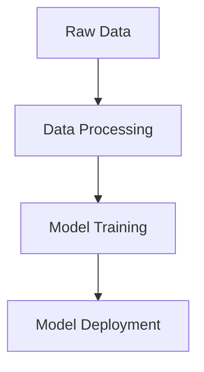
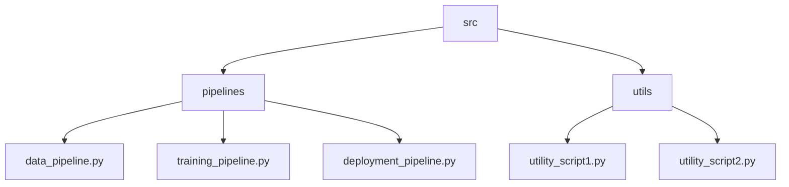

# FullStack DS Project

This project is a comprehensive data science pipeline that includes data processing, model training, and deployment. The goal is to automate the entire workflow from raw data to model deployment.

## Project Structure

- `data/`: Contains raw and processed data.
- `notebooks/`: Jupyter notebooks for exploratory data analysis.
- `src/`: Source code for the project.
  - `pipelines/`: End-to-end machine learning pipelines.
  - `utils/`: Utility functions and scripts.

## Pipeline Flowchart

Below is a flowchart that illustrates the end-to-end pipeline:



## src Folder Structure

Below is a flowchart that illustrates the structure of the `src` folder:



## Getting Started

1. Clone the repository.
2. Install the required dependencies.
3. Run the pipelines as needed.

## Dependencies

- Python 3.x
- pandas
- scikit-learn
- other dependencies...

## Usage

To run the data processing pipeline:
```bash
python src/pipelines/data_pipeline.py
```

To run the training pipeline:
```bash
python src/pipelines/training_pipeline.py
```

To deploy the model:
```bash
python src/pipelines/deployment_pipeline.py
```
