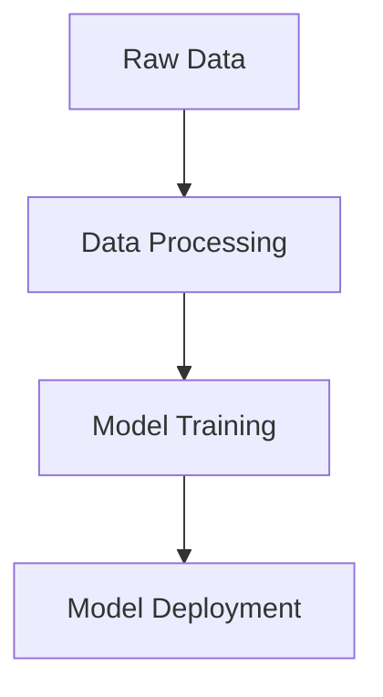
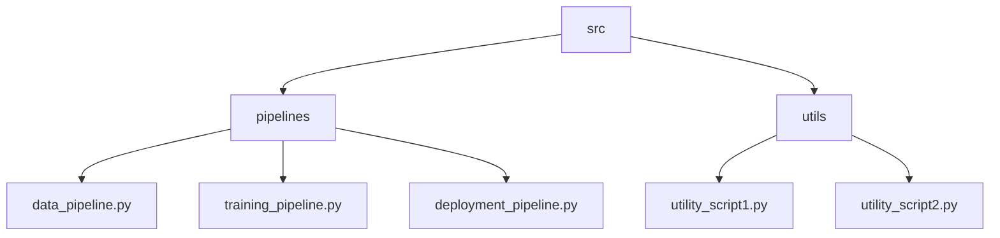

# FullStack DS Project

This project is a comprehensive data science pipeline that includes data processing, model training, and deployment. The goal is to automate the entire workflow from raw data to model deployment.

## Project Structure

- `data/`: Contains raw and processed data.
- `notebooks/`: Jupyter notebooks for exploratory data analysis.
- `src/`: Source code for the project.
  - `pipelines/`: End-to-end machine learning pipelines.
  - `utils/`: Utility functions and scripts.

## Pipeline Flowchart

Below is a flowchart that illustrates the end-to-end pipeline:



## src Folder Structure

Below is a flowchart that illustrates the structure of the `src` folder:



## Getting Started

1. Clone the repository.
2. Install the required dependencies.
3. Run the pipelines as needed.

## Dependencies

- Python 3.x
- pandas
- scikit-learn
- other dependencies...

## Usage

To run the data processing pipeline:
```bash
python src/pipelines/data_pipeline.py
```

To run the training pipeline:
```bash
python src/pipelines/training_pipeline.py
```

To deploy the model:
```bash
python src/pipelines/deployment_pipeline.py
```


# Utils Directory

The `utils` directory contains utility functions and helper scripts used across the project. These scripts provide common functionalities that are reused in different parts of the project.

## Python Files

- **file_utils.py**: Functions for file operations.
- **data_utils.py**: Helper functions for data manipulation.
- **model_utils.py**: Utility functions for model operations.

## Functions

### file_utils.py

- `read_file(file_path: str) -> str`: Reads the content of a file.
  - **Parameters**: `file_path` (str) - Path to the file.
  - **Returns**: Content of the file as a string.

### data_utils.py

- `split_data(df: pd.DataFrame, test_size: float) -> Tuple[pd.DataFrame, pd.DataFrame]`: Splits the DataFrame into training and testing sets.
  - **Parameters**: `df` (pd.DataFrame) - Input DataFrame.
  - **test_size** (float) - Proportion of the data to include in the test split.
  - **Returns**: Tuple containing training and testing DataFrames.

### model_utils.py

- `save_model(model: Model, file_path: str) -> None`: Saves the trained model to a file.
  - **Parameters**: `model` (Model) - Trained machine learning model.
  - **file_path** (str) - Path to save the model file.
