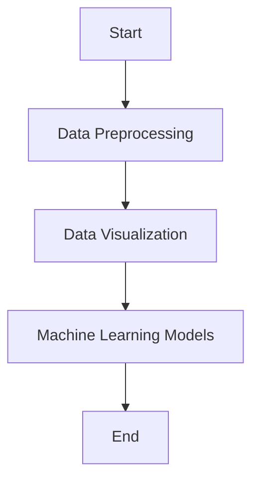

# Components Folder

## Purpose
The `components` folder contains various components that are essential for the functionality of the project. Each component is designed to handle specific tasks and contribute to the overall workflow of the project.

## Python Files and Functions

### 1. `file1.py`
**Description:** This file handles the data preprocessing tasks.

#### Functions:
- `function1(param1: type, param2: type) -> return_type`
  - **Parameters:**
    - `param1`: Description of param1.
    - `param2`: Description of param2.
  - **Returns:** Description of the return value.

### 2. `file2.py`
**Description:** This file is responsible for data visualization.

#### Functions:
- `function2(param1: type, param2: type) -> return_type`
  - **Parameters:**
    - `param1`: Description of param1.
    - `param2`: Description of param2.
  - **Returns:** Description of the return value.

### 3. `file3.py`
**Description:** This file manages the machine learning models.

#### Functions:
- `function3(param1: type, param2: type) -> return_type`
  - **Parameters:**
    - `param1`: Description of param1.
    - `param2`: Description of param2.
  - **Returns:** Description of the return value.

## Flowchart

````
